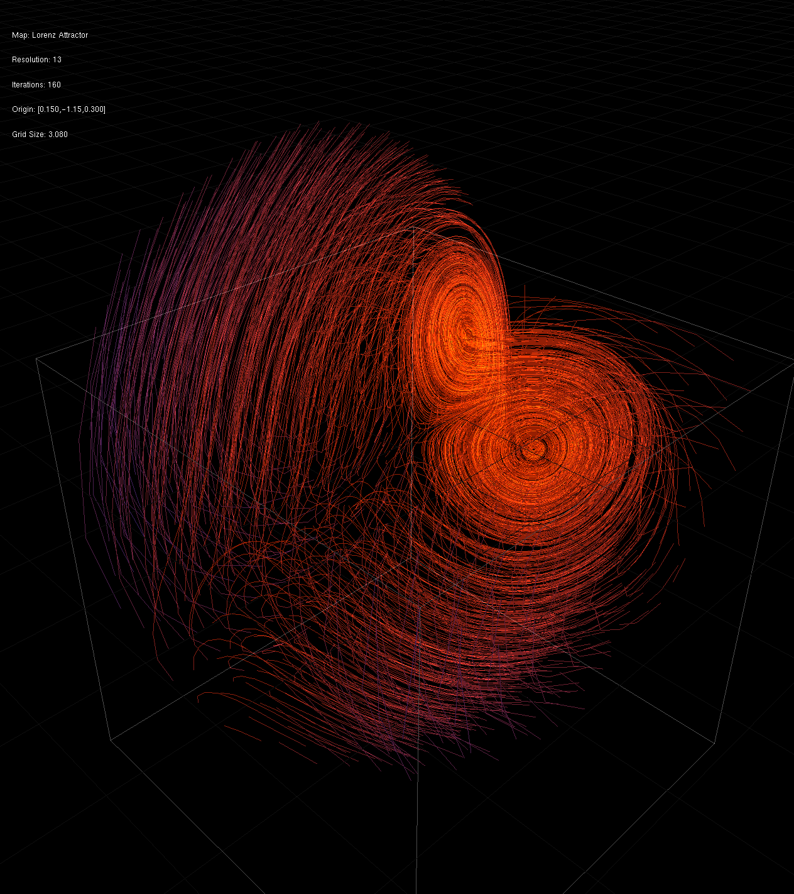
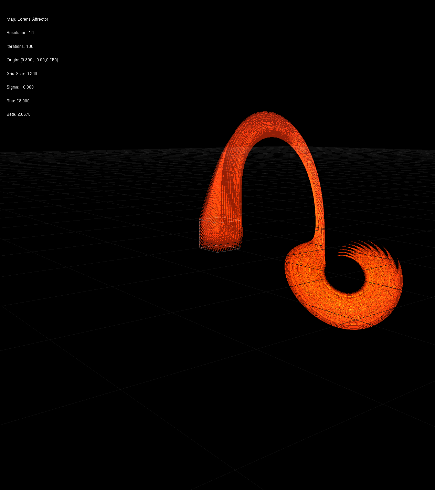
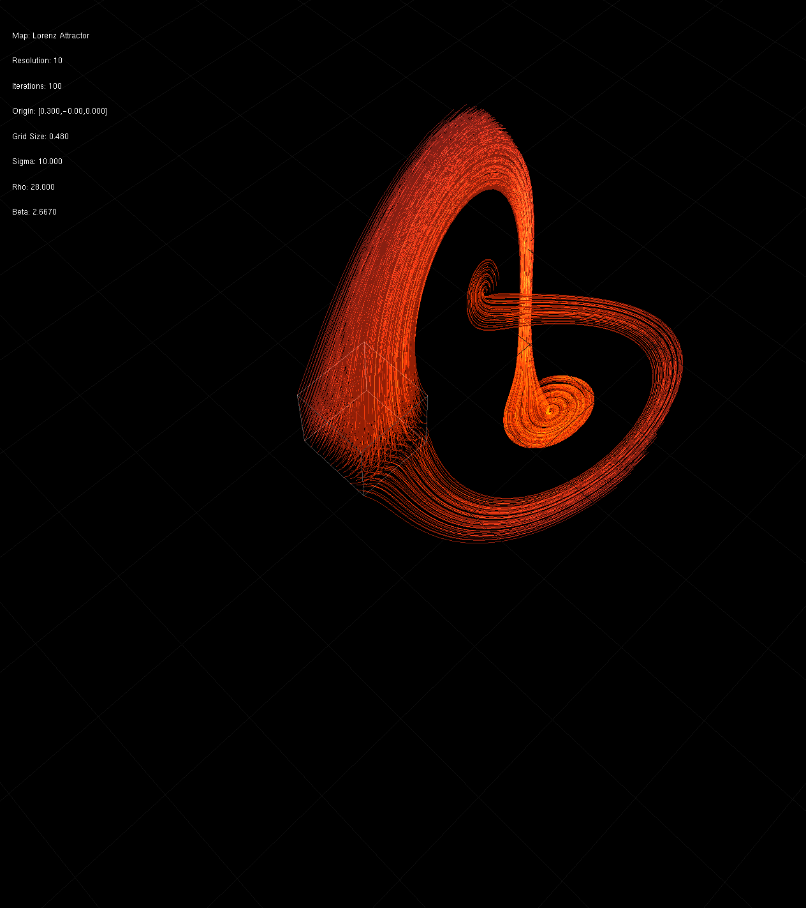
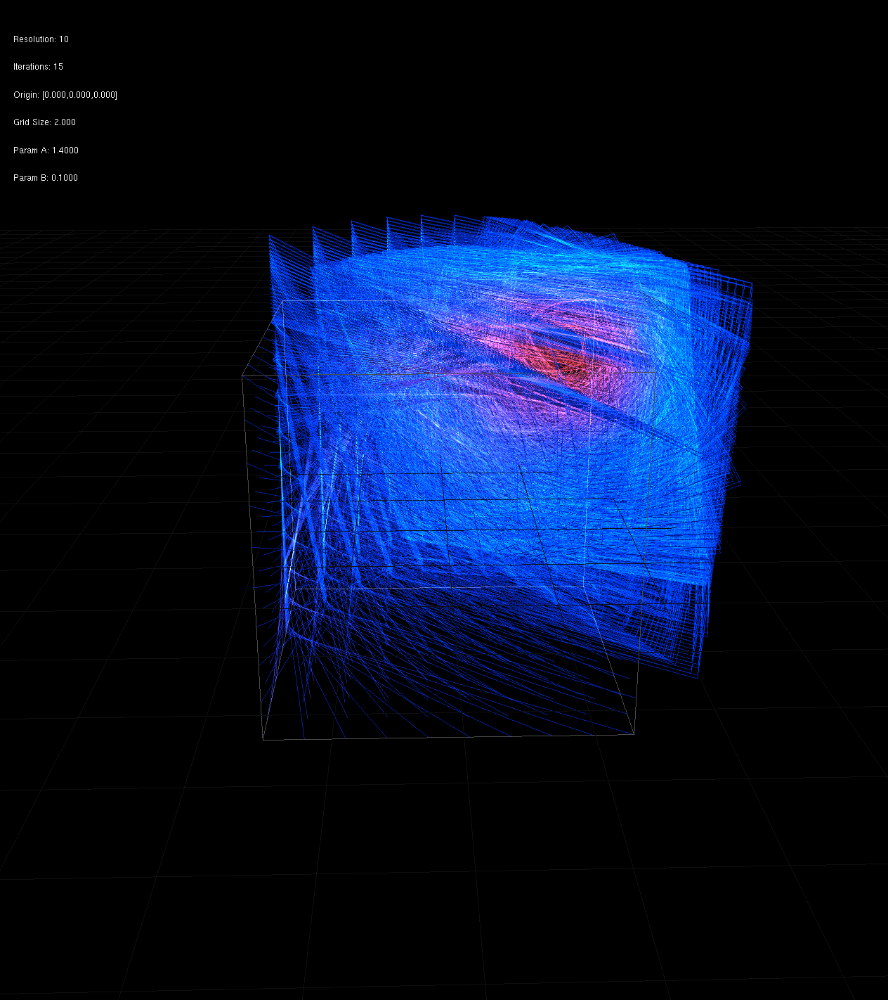
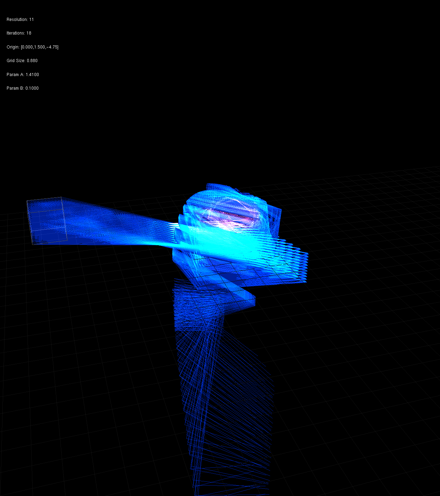
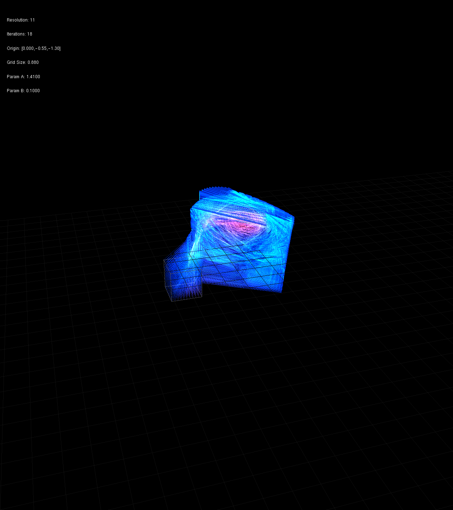
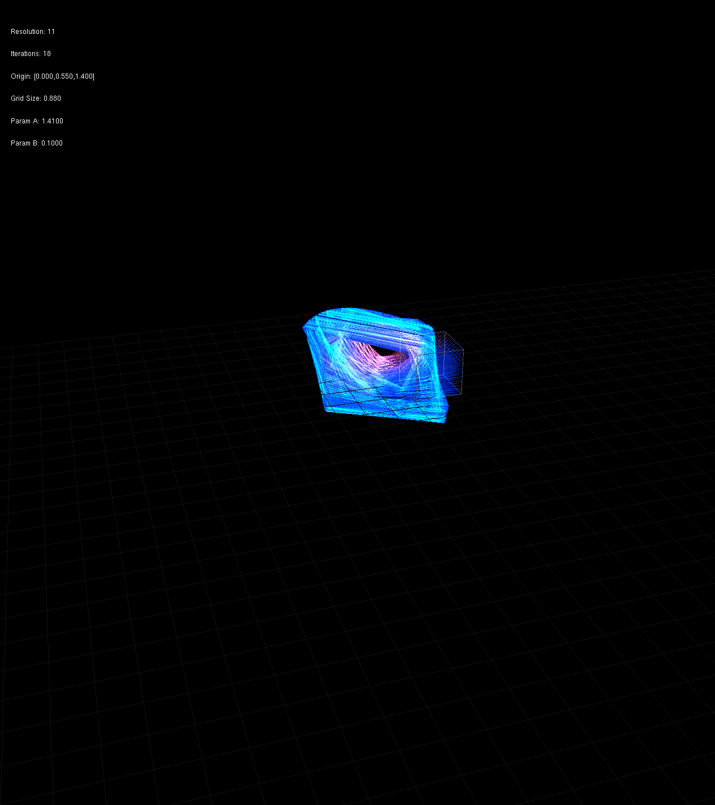
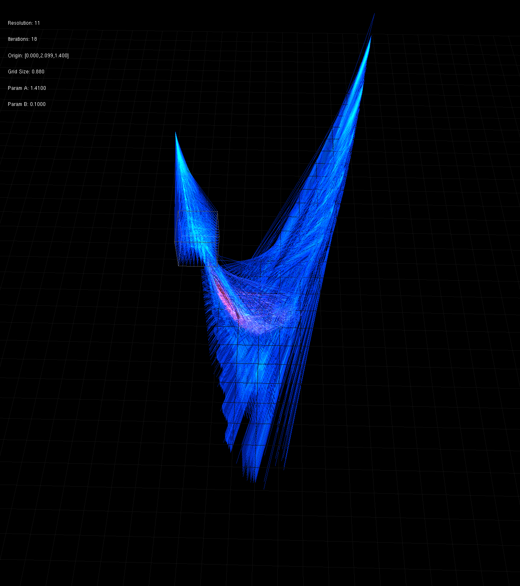
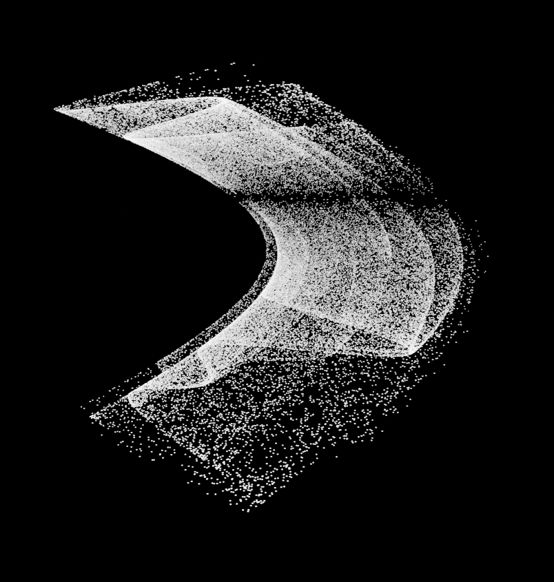

# Attractor Visualizations

This repository provides tools for exploring strange attractors, including the Hénon map and the Lorenz attractor.

## Real-time Visualizer (`flow_map`)

The main application is an interactive, real-time visualizer for exploring attractor flow fields.

### Usage
The `flow_map` executable can be run with an optional argument to select the map.

```bash
# Run with the default map (Henon)
./build/bin/flow_map

# Specify a map to view
./build/bin/flow_map lorenz
```

### Controls

| Key(s) | Action | With `Ctrl` |
|---:|:---|:---|
| Arrow keys (← ↑ → ↓) | Rotate camera / orbit view | Axis-locked movement: move field origin cube along dominant axis |
| `PageUp` / `PageDown` | Zoom camera in / out | Adjust field grid `range` (scale) |
| `R` | Increase `field.resolution` (grid samples) | Decrease `field.resolution` |
| `I` | Increase `field.iterations` (per-sample trajectory length) | Decrease `field.iterations` |
| `X`, `C`, `V` | Modify map-specific parameters (e.g., `a` and `b` for Hénon) | Decrease parameter value |
| `Y` | Save a screenshot (PNG) to `renders/` | N/A |

Notes: parameter keys are throttled (changes apply at ~0.1s intervals) and HUD values are shown on-screen.


### Lorenz Attractor
The classic "butterfly" attractor, visualized from a field of starting points



By moving and scaling the origin field you can see how it goes only to a single attractor



Here you can see how part of the origin field splits and go towards each attractor




### Henon Attractor



Each point in the field origin cube is iterated over allowing you to vizualize the attractor



You can zoom in / out & move the camera around.



You can move & scale the field origin cube



You can change grid resolution & number of iterations.


You can change Henon's a & b parameters.



Colors are based on each point's rate of change.


## PLY Exporter

- `blender_viz/henon_ply_creator.cpp` is the data exporter: it generates a plain ASCII PLY file (`henon_3d.ply`) that you can import into Blender or other 3D tools for offline rendering and post-processing.

Example exporter output (Blender preview):




## Building

### Requirements
- C++17 compiler
- CMake 3.10+
- GLFW3, OpenGL, GLUT (for visualizers)

### Build
```bash
cmake .
make        # Build all targets to build/bin/
make clean  # Remove build directory
```

Executables:
- `build/bin/flow_map` - Interactive 3D field visualizer
- `build/bin/single_point_henon` - Single trajectory tracer
- `build/bin/henon_ply_creator` - PLY export utility
